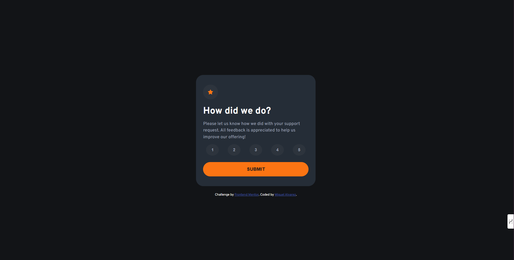
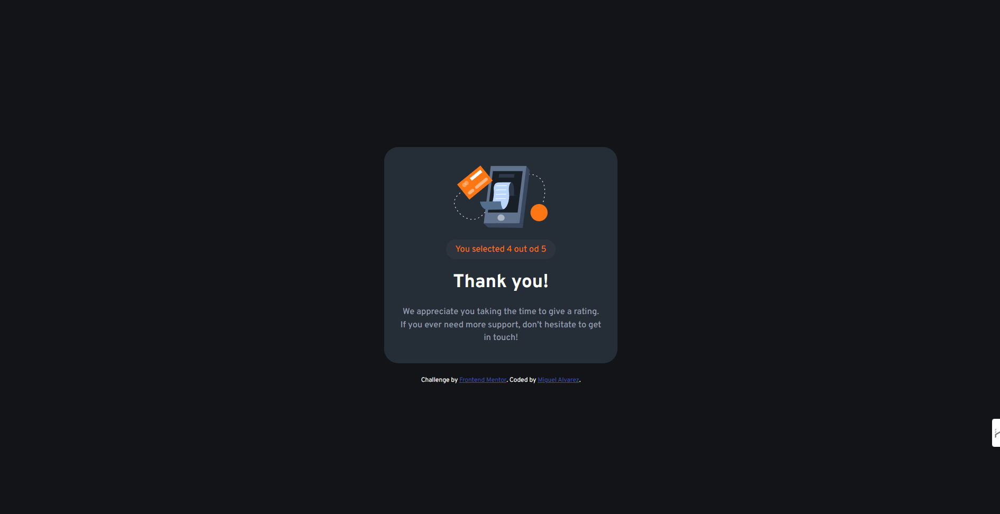

# Frontend Mentor - Interactive rating component

This is a solution to the [Interactive rating component challenge on Frontend Mentor](https://www.frontendmentor.io/challenges/interactive-rating-component-koxpeBUmI).

## Table of contents

- [Frontend Mentor - Interactive rating component](#frontend-mentor---interactive-rating-component)
  - [Table of contents](#table-of-contents)
  - [Overview](#overview)
    - [The challenge](#the-challenge)
    - [Screenshot](#screenshot)
    - [Links](#links)
    - [Built with](#built-with)
  - [Author](#author)

## Overview

### The challenge

Users should be able to:

- View the optimal layout for the app depending on their device's screen size
- See hover states for all interactive elements on the page
- Select and submit a number rating
- See the "Thank you" card state after submitting a rating

### Screenshot

### Links

- Solution URL: [Here](https://www.frontendmentor.io/solutions/interactive-rating-component-EzEAmS6dHF)
- Live Site URL: [Here](https://ghosthard117.github.io/interactive-rating-component/)

### Built with

- Semantic HTML5 markup
- CSS custom properties
- Flexbox
- Mobile-first workflow

## Author

- Website - [Miguel Alvarez](https://ghostharddev.vercel.app)
- Frontend Mentor - [@Ghosthard117](https://www.frontendmentor.io/profile/ghosthard117)
- LinkedIn - [Miguel Alvarez](https://www.linkedin.com/in/ghosthard117)
